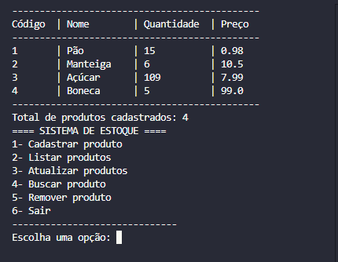

# 📦 Sistema de Controle de Estoque

Um sistema simples de controle de estoque feito em **Python** com banco de dados **SQLite**, totalmente em modo texto via terminal. Ideal para fins didáticos, controle local de produtos.

---

## 🚀 Funcionalidades

- ✅ Cadastro de produtos  
- 📄 Listagem de todos os produtos  
- 🔍 Busca de produtos por nome ou ID  
- ✏️ Atualização de informações de produtos  
- ❌ Remoção de produtos  
- 🧠 Armazenamento com banco de dados SQLite  
- 📁 Organização modular do código  

---
### 📸 Exemplo no terminal

